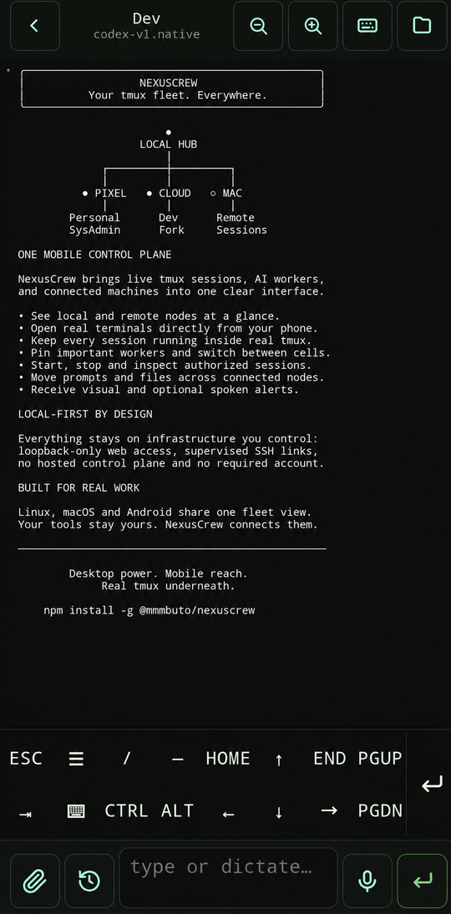

# NexusCrew

[](https://www.npmjs.com/package/@mmmbuto/nexuscrew)
[](LICENSE)
[](https://nodejs.org)
[](#platforms)

**Your tmux fleet. Everywhere.**

NexusCrew turns live tmux sessions, AI CLI workers and connected machines into
one local-first browser control plane. Your terminals stay real, your tools
stay yours, and your infrastructure stays under your control.

<p align="center">
  
</p>

## One control plane. Every screen.

<table>
  <tr>
    <td width="50%" align="center">
      
    </td>
    <td width="50%" align="center">
      
    </td>
  </tr>
  <tr>
    <td align="center"><strong>See the whole fleet</strong><br>Nodes, cells and live state at a glance.</td>
    <td align="center"><strong>Work from the terminal</strong><br>Real PTYs, mobile controls and file handoff.</td>
  </tr>
</table>

## Install in 30 seconds

```bash
npm install -g @mmmbuto/nexuscrew
nexuscrew
```

The first run creates a loopback-only runtime, starts it in the background and
opens the authenticated PWA.

| Platform | Prerequisites |
|---|---|
| Linux | Node.js 18+, tmux 3.4+, OpenSSH |
| macOS | `brew install node tmux` |
| Android / Termux | `pkg install nodejs-lts tmux openssh` |

NexusCrew ships scriptless PTY prebuilds for Linux x64/ARM64, macOS x64/ARM64
and Android ARM64. A normal global install does not need a compiler or native
install-script approval.

[Full installation guide →](docs/INSTALLATION.md)

## What NexusCrew gives you

| | |
|---|---|
| **Live terminals** | Attach to real tmux sessions through a real PTY, WebSocket and xterm.js. |
| **Persistent workspaces** | Arrange sessions into decks with saved layouts, ordering, pins and per-cell drafts. |
| **Multi-node Fleet** | See and control authorized cells across Linux, macOS and Android nodes. |
| **AI-ready cells** | Launch Claude Code, Codex, Codex-VL, Pi, Agy or a trusted shell with explicit providers and policies. |
| **Mobile-native control** | Scroll tmux history, use terminal keys, dictate prompts and move files from a phone. |
| **Operator alerts** | Receive visual, push and optional on-device spoken notifications. |

The browser is a client, not the session host:

```text
Browser PWA
    │  authenticated HTTP + WebSocket on loopback
    ▼
NexusCrew ── real PTY ── tmux sessions
    │
    ├── supervised OpenSSH ── remote NexusCrew nodes
    │
    └── stdio MCP bridge ── AI CLI workers
```

## Local-first by design

NexusCrew has no hosted control service, required account or public listener.
It binds to `127.0.0.1`, authenticates the PWA with a local token and leaves
session ownership to tmux.

- OpenSSH remains the network and identity authority.
- Provider credentials stay on the node that uses them.
- Pairing links contain no SSH private key, provider key or PWA token.
- File operations reject traversal and symlink escapes.
- Updates preserve tmux sessions and roll back when health checks fail.

Remote access is intentionally carried through SSH or a VPN you control:

```bash
ssh -L 41820:127.0.0.1:41820 user@your-host
```

[Security model →](docs/SECURITY.md)

## Documentation

| Guide | Covers |
|---|---|
| [Documentation index](docs/README.md) | Start here for every guide |
| [Installation](docs/INSTALLATION.md) | Linux, macOS, Termux, first run and upgrades |
| [Fleet and terminals](docs/FLEET.md) | Cells, engines, providers, decks and mobile input |
| [Connect nodes](docs/NODES.md) | Pairing, SSH routes, sharing and routed aliases |
| [Notifications](docs/NOTIFICATIONS.md) | Toasts, Web Push and optional spoken alerts |
| [MCP bridge](docs/MCP.md) | Operator tools, cell delivery and client setup |
| [Configuration](docs/CONFIGURATION.md) | Files, environment overrides and local settings |
| [Operations](docs/OPERATIONS.md) | CLI, boot, backup, updates and diagnostics |
| [Security](docs/SECURITY.md) | Trust boundaries, tokens and credential handling |

The repository also includes [MCP companion guidance](MCP_COMPANIONS.md),
the machine-readable [`mcp-companions.json`](mcp-companions.json), and portable
skills for memory, searchable document memory, bounded worker delegation,
mail assistance and form filling.

## Platforms

| Platform | Architectures | Background integration |
|---|---|---|
| Linux | x64, ARM64 | systemd user service or detached runtime |
| macOS | x64, ARM64 | LaunchAgent or detached runtime |
| Android / Termux | ARM64 | detached runtime and optional Termux:Boot |

Run `nexuscrew doctor` after installation or when moving configuration between
devices.

## Development

```bash
npm test
npm run build
node bin/nexuscrew.js serve
```

Tests that exercise tmux use private sockets and never attach to or terminate
the operator's tmux server.

See [CHANGELOG.md](CHANGELOG.md) for released changes.

## License

Apache-2.0 © 2026 Davide A. Guglielmi (DioNanos)
