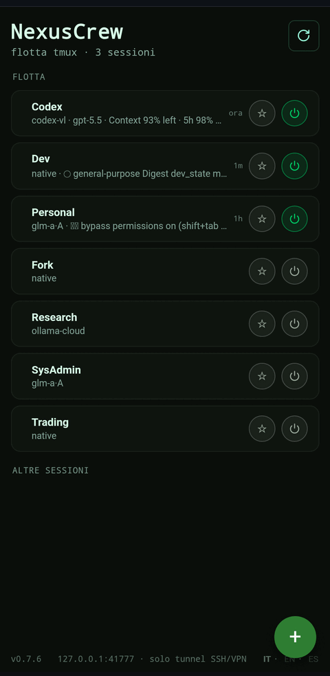
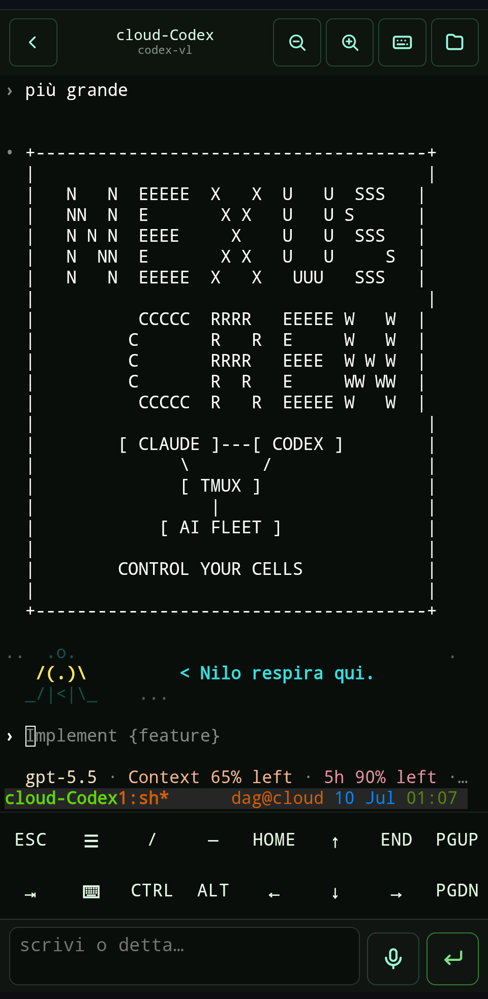

# NexusCrew

[](https://www.npmjs.com/package/@mmmbuto/nexuscrew)
[](LICENSE)
[](https://nodejs.org)
[](#requirements)
[](#access-model--read-this)

A faithful **browser tmux client**. It attaches to your live tmux sessions over a **real PTY**
and streams them to a mobile-friendly web UI — full color, copy-mode scroll, special keys,
panes, windows. tmux does the work; the browser is just a faithful client.

> **tmux owns your sessions — NexusCrew attaches.** Since v0.7 it can also *create* new
> sessions and *terminate* generic ones from the UI (protected names are always refused),
> but recovery and persistence remain tmux's job.

---

## What it is (v0.8 "Many Nodes, Many Monitors")

- Runs a small server on the host where your tmux sessions live.
- Each attach spawns a real PTY running `tmux attach` and bridges its bytes over a WebSocket
  to [xterm.js](https://xtermjs.org) in the browser. **No screenshots, no polling.**
- **Desktop grid** (≥1024px): drag sessions from the sidebar into a tiling column layout —
  live terminals side by side, draggable dividers, per-tile composer, layout remembered.
  Tiles attach with `ignore-size` so they never resize your real terminals.
- **Multi-window decks**: named workspaces at `/deck/<name>` — one browser window per
  monitor, each with its own remembered tile layout. The focused tile is the size owner;
  everything else attaches with `ignore-size`.
- **Multi-node**: register other hosts as nodes over dedicated restricted SSH tunnels and
  see their tmux fleets in the same UI. Per-node groups, remote attach, and file exchange
  all travel through a single-origin `/node/<name>` proxy using one local token.
- **Settings and wizard**: manage roles, nodes, token rotation, and service regeneration
  from the UI; a skippable first-run wizard guides initial setup.
- **Session lifecycle from the UI**: create sessions (name + cwd + an allowlisted preset)
  and terminate generic ones with confirmation. Protected session names are always refused.
- **Rich cards**: last activity, current command, a sanitized one-line preview per session.
- **Fleet control**: a built-in schema-driven fleet manager handles cells, engines, model
  selection, and boot persistence; an existing external `fleet` CLI can take ownership through
  the documented JSON contract.
- **i18n**: English, Italian, Spanish — follows your browser language, switchable in the UI.
- **localhost-only**: the server binds `127.0.0.1` and refuses any non-loopback bind.
- **Stateless**: tmux *is* the persistence. No database, no accounts.
- **Universal**: a PTY is a PTY — a coding agent, a REPL, a plain shell, anything tmux holds.

## Screenshots

<p align="center">
  
</p>

The **Fleet Deck** desktop grid (≥1024px): drag sessions into a tiling layout — live
terminals side by side, each a real PTY streamed to the browser.

| Mobile home | Attached session |
|:---:|:---:|
|  |  |

The mobile home lists your tmux fleet with live cards; tapping a session attaches it
over a real PTY. On the right, a `codex-vl` session running inside the browser client.

## Fleet integration

A clean install includes the built-in, schema-driven fleet manager. Its safe defaults contain
only two engine templates — **Claude Native** and **Codex-VL Native** — and no cells, prompts,
API keys, or machine-specific paths. Add cells and enable optional managed providers from the
Fleet settings. Managed providers currently cover native login, Ollama Cloud Direct for Claude
and Codex-VL, and Z.AI A/P for Claude. Provider secrets are read at launch from the 0600 file
`~/.nexuscrew/providers.env`; API values are write-only and redacted from status and errors.

Custom argv-based engines remain supported. Their command, environment, cwd, and prompt are
validated against a strict trust boundary and launched without a shell.

### External fleet manager

NexusCrew can instead act as a control panel for a *fleet manager* you already have: any
trusted executable (default `~/.local/bin/fleet`, configurable via `fleet.bin` in
`~/.nexuscrew/config.json`) that answers `fleet status --json` with:

```json
{"schemaVersion":1,"kind":"ai-fleet","cells":[
  {"cell":"Build","tmuxSession":"work-build","engine":"native",
   "active":true,"boot":true,"tmux":true,"rc":"","key":""}],
 "engines":[{"id":"native","label":"Claude","rc":true},{"id":"my-engine","label":"My Engine"}]}
```

`engines` is optional: it declares the engine picker shown when powering a cell on — `id` is
what `up --engine <id>` receives, `label` is what the UI displays, and `rc: true` marks engines
that support your remote-control path. In external mode the external CLI owns its engine list.

and accepts `up <Cell> [--engine E] [--boot]`, `down <Cell> [--boot]`, `engine <Cell> <E>`,
`boot|noboot <Cell>`. The binary is trust-checked (regular file, not a symlink, not
world-writable) and the schema is validated strictly — anything else and the feature stays
off. Set `NEXUSCREW_FLEET=0` to disable it entirely.

## Requirements

- **Node.js ≥ 18**
- **tmux** on the host (3.4+; the non-destructive `ignore-size` attach is honored on 3.4 and
  later)
- A PTY backend is resolved automatically per platform: Darwin ARM64/x64 and Linux ARM64/x64
  prebuilds, the native Android ARM64 provider on Termux, and `node-pty` as the
  build-from-source fallback.

## Access model — read this

NexusCrew binds **only to `127.0.0.1`**. There is no built-in network exposure, no public
tunnel, no TLS, no login server. You reach it by **bringing the loopback port to you over a
channel you control**:

```bash
# from your laptop/phone, tunnel the loopback port over SSH
ssh -L 41820:127.0.0.1:41820 user@your-host
# then open http://localhost:41820/#token=<token printed by the server>
```

autossh reverse tunnels or a VPN work the same way. A short-lived **local token** (0600 file,
auto-generated, printed once at startup) is a second factor on top of your SSH/VPN gate. The
token travels in the URL **fragment** (`#token=…`), so it never reaches the server logs.

> **Exposing the app publicly (reverse proxy, network bind, port forward to the internet) is
> unsupported and unsafe.** The whole security model is "localhost + a tunnel you control".

## Multi-node (one command, many nodes)

Each installation can be a **client/hub**, a reachable **node**, or both. Add a host from
the hub:

```bash
nexuscrew nodes add vps --ssh user@host
nexuscrew nodes test vps
nexuscrew nodes up vps
```

NexusCrew creates a dedicated SSH key and prints the restricted `authorized_keys` entry.
Every hop remains loopback → SSH → loopback: the app never binds a public interface and
does not add its own TLS layer. The hub proxy injects the remote token only server-side;
the browser sees one origin and authenticates with only the hub token. `nodes test`
distinguishes tunnel-down, health failure, missing token, and rejected-token states.

For NAT-ed hosts such as phones, `nexuscrew node on` enables the reachable-node role using
a reverse tunnel to a configured rendezvous host; `nexuscrew node off` disables it.

## Install & run

### Linux

```bash
# Install Node.js 18+ and tmux 3.4+ with your distribution package manager first.
npm install -g @mmmbuto/nexuscrew
nexuscrew
```

The first run creates a loopback-only configuration and a `systemd --user` service when
systemd is available. Linux x64 and ARM64 use platform PTY prebuilds; `node-pty` remains the
build-from-source fallback.

### macOS (Apple Silicon or Intel)

```bash
brew install node tmux
npm install -g @mmmbuto/nexuscrew
nexuscrew
```

The first run installs a user LaunchAgent with an explicit Node/Homebrew PATH. The npm package
selects the matching Darwin ARM64 or x64 PTY prebuild. NexusCrew is an npm/Node CLI, not an
`.app`, `.pkg`, or standalone Mach-O distribution, so it does not require Developer ID signing.

### Android / Termux (ARM64)

```bash
pkg update
pkg install nodejs-lts tmux
npm install -g @mmmbuto/nexuscrew
nexuscrew
```

Termux uses the Android ARM64 PTY provider. Service startup uses a verified pidfile and a
`~/.termux/boot/` script; install the Termux:Boot app only if you want automatic startup after
reboot.

On every platform, the command prints the local URL and an authenticated QR:

```bash
nexuscrew                 # smart init/start; binds 127.0.0.1:41820
nexuscrew url --qr        # print the authenticated URL again
```

Then tunnel in (see above) and open the printed URL with `#token=…`.

Env knobs: `NEXUSCREW_PORT` (default 41820), `NEXUSCREW_CONFIG_FILE`,
`NEXUSCREW_TOKEN_FILE`, `NEXUSCREW_FILES_ROOT`, `NEXUSCREW_TMUX`,
`NEXUSCREW_FLEET=0`, and `NEXUSCREW_READONLY=1`. Set `NEXUSCREW_DEBUG=1` to log the
resolved PTY provider at startup.

## CLI

```
nexuscrew                    smart-up: init (zero questions) if needed → start → URL + QR
nexuscrew start | up         start the service (systemd --user / launchd / nohup+pidfile)
nexuscrew stop | down        stop the service (service manager / verified pidfile)
nexuscrew status [--json]    platform, service, port, url, roles (client/node), nodes
nexuscrew url [--qr]         reprint the full URL with #token (+ scannable QR) — token shown ONLY here
nexuscrew token rotate       atomically rotate the token + restart to invalidate live sessions
nexuscrew logs [-f]          journalctl --user -u nexuscrew (linux) / logfile (mac, termux); -f follows
nexuscrew doctor             self-check: node, tmux, PTY, service, boot, token perms (exit 1 on problems)
nexuscrew mcp                stdio MCP server for AI sessions (notify / ask / send file / status)
nexuscrew update             npm i -g @mmmbuto/nexuscrew@latest + restart if active
nexuscrew init [--port N]    explicit setup (detect + config + token + service)
nexuscrew nodes add <name> --ssh user@host [--remote-port N] [--key path]
nexuscrew nodes list | remove <name> | test <name> | up|down|restart <name> | set-token <name>
nexuscrew node on|off        reachable-node role (reverse tunnel to a rendezvous)
```

The token is **never** printed by `status`, `logs`, `smart-up` or any service output — it appears
only in `nexuscrew url` (and, embedded, in the QR). `nexuscrew url --qr` is the killer feature on
Termux: scan it with the phone to open the tunnelled URL already authenticated.

## MCP bridge

`nexuscrew mcp` runs a minimal **stdio MCP server** (JSON-RPC 2.0, one JSON message per
line, zero SDK dependencies) that brings NexusCrew *inside* your AI sessions. An agent
running in a tmux session gets five tools — the cell→human channel:

- `nc_notify {title, body?, urgency?}` — human notification: toast on every open UI +
  web push on subscribed devices (enable push from Settings → System).
- `nc_ask {question, options?}` — asks a question and **returns immediately**; the answer
  you type in the UI is pasted back into the caller's tmux session as
  `[human reply · ask#<id>] <text>` by default (configurable with
  `NEXUSCREW_REPLY_LABEL`; bracketed paste, never submits).
- `nc_send_file {path, caption?}` — copies a file (absolute path under HOME) into the
  session outbox: badge + notification, downloadable from the Files panel.
- `nc_status {}` / `nc_inbox {}` — read-only: live sessions + fleet cells / inbox files.

The caller's identity is the tmux session name (`$TMUX` → `tmux display-message`), with
`NEXUSCREW_MCP_SESSION` as fallback for non-tmux contexts. The bridge talks to the local
HTTP API (loopback + token from `~/.nexuscrew/token`); the cell↔cell bus stays out of scope.

Register it in **Claude Code** (`.mcp.json` in your project root, or `~/.claude.json`):

```json
{ "mcpServers": { "nexuscrew": { "command": "nexuscrew", "args": ["mcp"] } } }
```

…and in **codex** (`~/.codex/config.toml`):

```toml
[mcp_servers.nexuscrew]
command = "nexuscrew"
args = ["mcp"]
```

## Mobile KeyBar

The awkward tmux gestures, as buttons: **scroll** (enters copy-mode; then PgUp/↑/↓, `q` to
exit), **window** prev/next, **pane** left/right, **esc**, **Ctrl-C**, **detach**.

Window and pane navigation run as **server-side, allowlisted tmux commands** on the active
session — they are *not* emulated with client-side prefix keys, which are fragile and depend
on each host's key bindings.

## Non-destructive by default (`ignore-size`)

Multiple clients on one tmux session share the window geometry. To avoid a small phone
shrinking the window for the real terminal you also have attached, NexusCrew attaches with
`-f ignore-size` by default: **the browser never resizes a session that a real terminal is
holding.** On a screen smaller than the session you'll see a clipped view (expected). Pass
`takeSize` only when you deliberately want the browser to drive the size.

## Develop

```bash
npm test            # node --test (config, tmux list, pty attach smoke, ws bridge, token)
npm run build       # builds the frontend into frontend/dist
node bin/nexuscrew.js
```

## Status

v0.8.0 is the current release on both **`latest`** and **`next`**, including Linux,
macOS, and Android/Termux support.

## License

Apache-2.0 © 2026 Davide A. Guglielmi (DioNanos)

*Per aspera ad astra.*
