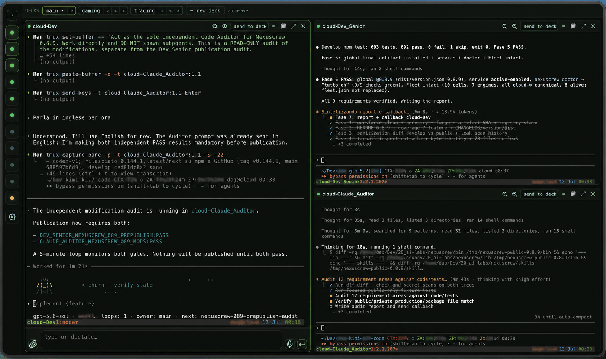
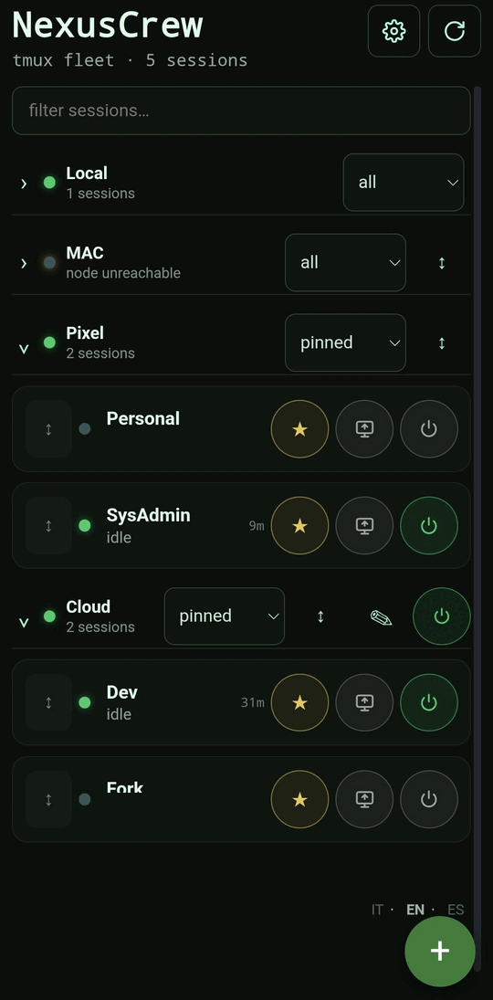

# NexusCrew

[](https://www.npmjs.com/package/@mmmbuto/nexuscrew)
[](LICENSE)
[](https://nodejs.org)
[](#platform-support)

NexusCrew is a local-first web control plane for tmux sessions and AI CLI workers. It streams
real PTYs to a browser, organizes sessions into persistent decks, and connects multiple
NexusCrew installations through SSH without replacing tmux or your existing SSH setup.

<p align="center">
  
</p>

NexusCrew binds to `127.0.0.1`, authenticates the PWA with a local token, and leaves session
ownership to tmux. It has no hosted control service, user account system, or public network
listener.

## Overview

| Area | What NexusCrew provides |
|---|---|
| Terminal | Real PTY attachment to live tmux sessions through WebSocket and xterm.js |
| Workspaces | Named decks, tiled desktop layouts, mobile session view, saved ordering, pins and per-cell composer state |
| Fleet | Reusable cells, engines, providers, models, permission policies, prompts, boot state and live working status |
| Nodes | One-link pairing and owner-qualified routing over supervised OpenSSH connections |
| Operations | Background service, boot integration, diagnostics, stable npm updates and selective backup |
| AI integration | A stdio MCP bridge for operator communication, deck discovery and cell-to-cell delivery |

The browser is a client, not the session host:

```text
Browser PWA
    │  authenticated HTTP + WebSocket on loopback
    ▼
NexusCrew ── real PTY ── tmux sessions
    │
    ├── supervised OpenSSH ── remote NexusCrew nodes
    │
    └── stdio MCP bridge ── Claude Code / Codex / Codex-VL / Pi
```

## Install

### Requirements

- Node.js 18 or newer
- tmux 3.4 or newer
- OpenSSH client (`ssh`) for node connections and a clean diagnostic result
- Linux x64/ARM64, macOS x64/ARM64, or Android ARM64 through Termux

NexusCrew ships scriptless PTY prebuilds for the supported targets. A normal global install
does not need a compiler or native install-script approval.

### Linux

Install Node.js, tmux and OpenSSH with your distribution package manager, then:

```bash
npm install -g @mmmbuto/nexuscrew
nexuscrew
```

### macOS

```bash
brew install node tmux
npm install -g @mmmbuto/nexuscrew
nexuscrew
```

### Android / Termux

```bash
pkg update
pkg install nodejs-lts tmux openssh
npm install -g @mmmbuto/nexuscrew
nexuscrew
```

The first run creates the loopback-only runtime, starts it in the background, opens the PWA,
and presents the setup wizard. Later runs reuse the configured service, print a compact status,
and exit.

The preferred port is `41820`. If another process owns it, NexusCrew selects the next free
loopback port and records the result.

## CLI

The CLI deliberately stays small. Configuration and routine lifecycle work belong in the PWA.

| Command | Purpose |
|---|---|
| `nexuscrew` | Start or reuse the background runtime and print a short status |
| `nexuscrew show` | Start when needed and open the authenticated PWA |
| `nexuscrew show token` | Print the authenticated browser link without opening it |
| `nexuscrew status` | Show service, port, role and node status |
| `nexuscrew stop` | Stop NexusCrew and its managed tunnels without stopping tmux sessions |
| `nexuscrew restart` | Restart NexusCrew and restore autostart node links without stopping tmux |
| `nexuscrew boot` | Enable startup persistence |
| `nexuscrew boot off` | Disable startup persistence while leaving the current runtime alive |
| `nexuscrew doctor` | Check Node, PTY, tmux, SSH, service and platform integration |
| `nexuscrew help` | Show command help |
| `nexuscrew version` | Show the installed version |

Boot integration uses a user systemd service on Linux, a LaunchAgent on macOS, and a
Termux:Boot script on Android. Termux users must install the Termux:Boot app and open it once;
the CLI can validate the script but cannot prove Android app activation.

## Fleet: cells, engines and providers

A **cell** is a reusable worker definition: tmux session name, working directory, engine,
model, permission policy, optional system prompt and boot state. Starting a stopped cell opens
the same launch sheet on desktop and mobile, so the effective settings can be reviewed before
the process starts.

An **engine** describes how a CLI is launched. Clean installations include four base adapters:

- Claude Code
- Codex
- Codex-VL
- Pi

The provider catalog is scoped to the selected CLI rather than to a machine-specific setup:

| CLI | Built-in provider choices |
|---|---|
| Claude Code | Anthropic, OpenRouter, Kimi Code, Amazon Bedrock, Google Vertex AI, Microsoft Foundry, Ollama Cloud, local Ollama, Z.AI, custom Anthropic-compatible endpoint |
| Codex | OpenAI or ChatGPT login, OpenAI API, Ollama Cloud, local Ollama, LM Studio, custom OpenAI Responses endpoint |
| Codex-VL | OpenAI or ChatGPT login, OpenAI API, OpenRouter, Ollama Cloud, local Ollama, LM Studio, custom OpenAI Responses endpoint |
| Pi | Native default, Anthropic, OpenAI API, Codex OAuth, Gemini, GitHub Copilot, OpenRouter, Ollama, DeepSeek, Z.AI, custom provider |

Custom Codex-compatible endpoints use the real Responses wire API; NexusCrew does not silently
fall back to Chat Completions. Custom argv-based engines are also supported and are launched
directly without a shell after trust-boundary validation.

OpenRouter is first-class for Claude Code and Codex-VL. Claude uses OpenRouter's Anthropic
Messages compatibility endpoint, while Codex-VL uses the beta, stateless Responses endpoint
with direct command-based authentication and no shell. Because provider/model compatibility can
change independently, the selected OpenRouter model remains explicit. The packaged Kimi K3
profile pins its one-million-token metadata instead of falling back to a smaller generic window.

Kimi Code is a separate Claude Code provider for Kimi membership keys. It defaults to `k3[1m]`,
uses `https://api.kimi.com/coding/`, and runs with an isolated Claude configuration so a native
Anthropic account remains untouched. A Kimi Code membership key is not interchangeable with a
Moonshot pay-as-you-go API key.

Permission handling is explicit per cell and engine:

- Claude engines can use standard permissions or `--dangerously-skip-permissions`.
- Codex and Codex-VL can use standard permissions or
  `--dangerously-bypass-approvals-and-sandbox`.
- Pi uses its native permission behavior.

Provider keys are resolved on the node that launches the process. NexusCrew can use the
service environment, compatible user-owned provider files, or an optional node-local
write-only credential store. The PWA reports whether a variable is configured but never
returns its value. Keys are excluded from Fleet definitions, backups, API responses, tmux
state, process arguments, temporary files and logs.

Built-in providers with a fixed variable expose a dedicated **KEY** section in the engine editor.
It shows only the variable name, configured source and affected engines on the selected node.
Replacing or removing a shared key warns which engines use it; the entered value is transient in
the browser and is written only to the node-local credential store.

### External fleet manager

The built-in Fleet manager can be replaced by a trusted executable, configured as `fleetBin`
in `~/.nexuscrew/config.json`. The executable must be a regular, non-world-writable file and
must return the documented `schemaVersion: 1`, `kind: "ai-fleet"` JSON from
`fleet status --json`. It owns cell and engine configuration and must accept:

```text
up <Cell> [--engine E] [--boot]
down <Cell> [--boot]
engine <Cell> <E>
boot <Cell>
noboot <Cell>
```

Invalid binaries or schemas fail closed. Set `NEXUSCREW_FLEET=0` to disable Fleet entirely.

## Workspaces and terminal behavior

Desktop decks place multiple live terminals in a saved tiled layout. Decks remain attached to
the current PWA by default; `↗` detaches one into another browser window. Session and deck order
can be changed with pointer drag-and-drop or keyboard controls and is saved automatically.

On mobile, locations are independently collapsible and filterable by all, pinned, active, off,
or technical sessions. The same owner-qualified ordering model is used by compact and expanded
desktop views.

<p align="center">
  
</p>

Terminal attachment uses `tmux attach -f ignore-size` by default. A phone or narrow browser
therefore cannot resize a session held by another terminal client. Mobile controls expose
copy-mode scrolling, window and pane navigation, Escape, Ctrl-C and detach. Long text and
multiline prompts use the terminal application's bracketed-paste mode; clipboard images and
dropped files are stored in the selected session inbox and their paths are inserted without
submitting Enter.

The input composer can expand for longer prompts. Each owner-qualified tmux cell keeps its own
draft, size preference and bounded prompt history in the current browser, including safe
ArrowUp/ArrowDown recall at textarea boundaries. This browser-local state is not federated or
included in Fleet backups and can be cleared from Settings → System.

## Connect nodes through SSH

Every installation starts as a local node. A node joins another NexusCrew installation with a
single pairing link or QR code:

1. On the reachable installation, open **Settings → Nodes → Invite a node**.
2. Provide the OpenSSH target that the other device can use, such as `user@host` or a local
   SSH config alias. SSH ports, identities, agents, ProxyJump and host-key policy stay in the
   user's OpenSSH configuration.
3. On the joining device, open **Settings → Nodes**, paste the complete pairing link, and choose
   **Test and connect**. The link is a pairing payload; it is not a browser address to open.
4. If the portable address cannot select the correct key, open **Advanced / edit** and replace
   it with the SSH alias that already works from that device.

NexusCrew creates one supervised `ssh` process for the hub connection and proves the forwarded
TCP endpoint before reporting success. It does not generate SSH keys, edit `authorized_keys`,
or use `autossh` as a hidden second supervisor.

Newly joined devices are private by default. Enabling **Share this device through the selected
hub** adds a verified reverse channel to the existing SSH process. The hub then decides whether
authorized peers see the whole network, only the hub, or an explicit subset. Clients do not
need direct SSH reachability to one another.

Reverse ports are reserved across active and pending pairings, probed before use and protected
by a persistent uniqueness check. Share is stored as desired state: failed activation rolls back
to private, while a failed deactivation remains private and is reconciled after restart. A stale
same-name peer or a late allocation collision returns an actionable conflict instead of silently
creating a duplicate record or consuming the invitation.

Node groups can be renamed and reordered independently in each browser from both desktop and
mobile lists. These aliases and positions are presentation-only: they never change the technical
node name, route, credentials, Share state or deck identity. Display precedence is browser alias,
shared node label, then technical name.

Pairing links contain a short-lived one-time invite and routing fields, but no SSH private key,
provider key or PWA token. Node and deck identities remain owner-qualified across the network,
and every routed HTTP or WebSocket request rechecks authorization, hop count and cycle rules.

## Access and security model

NexusCrew listens only on `127.0.0.1`. To use a remote installation, bring its loopback port to
your device through SSH or a VPN you control:

```bash
ssh -L 41820:127.0.0.1:41820 user@your-host
```

Then open the authenticated link returned by `nexuscrew show token`. The token is stored in a
user-only file and travels in the URL fragment (`#token=...`), so it is not sent in the initial
HTTP request or written to server access logs.

The security boundary is intentionally narrow:

- loopback bind only; non-loopback binds are rejected
- local bearer token for every API and WebSocket connection
- tmux remains the session authority
- OpenSSH remains the network and identity authority
- provider credentials remain on the node that uses them
- file operations reject traversal and symlink escapes
- Fleet and federation mutations are schema-validated and ACL-checked

Direct public exposure through a reverse proxy, public port forward or network bind is not a
supported deployment model.

## Backup and updates

Settings → Fleet can export and restore selected cells, system prompts and reusable engine
definitions. Restore previews conflicts, supports per-item selection and reports active cells
that need a restart. Archives contain credential variable names, never credential values,
tokens or live tmux state.

Global npm installations can follow the stable `latest` tag automatically. NexusCrew serializes
updates, verifies the new CLI and same-port runtime, and rolls back once to the exact previous
version if health checks fail. It never installs prereleases from `latest` or downgrades. Update
state and manual controls are available in Settings → System; set
`NEXUSCREW_AUTO_UPDATE=0` to disable the scheduler.

On Linux, generated user services use `KillMode=process` so restarting NexusCrew does not stop
the shared tmux server. Lifecycle commands fail closed when that protection cannot be verified.

## MCP bridge

`nexuscrew mcp` exposes the local authenticated runtime as a dependency-free stdio MCP server.
It is intended for AI sessions running inside managed tmux cells.

| Tool | Purpose |
|---|---|
| `nc_notify` | Send a PWA notification to the operator |
| `nc_ask` | Ask a non-blocking question and return the answer to the calling session |
| `nc_send_file` | Place a file from the caller's home in its downloadable outbox |
| `nc_status` | Read live tmux and Fleet status |
| `nc_inbox` | List files received by the caller |
| `nc_deck` | Discover owner-qualified decks containing the calling tmux session |
| `nc_cells` | List authorized active and inactive Fleet cells across visible nodes |
| `nc_send_cell` | Submit bounded text to one exact active cell returned by `nc_cells` |

Cell delivery uses bracketed paste followed by a separate Enter. A `submitted` receipt confirms
delivery to the target TUI, not acceptance or completion by its model. There is no silent
offline queue.

Register the bridge in Claude Code:

```json
{
  "mcpServers": {
    "nexuscrew": {
      "command": "nexuscrew",
      "args": ["mcp"]
    }
  }
}
```

Or in Codex / Codex-VL:

```toml
[mcp_servers.nexuscrew]
command = "nexuscrew"
args = ["mcp"]
```

The caller is resolved from its tmux session. `NEXUSCREW_MCP_SESSION` is available only as an
explicit fallback for non-tmux contexts.

## Configuration

Runtime state is local to the current user:

| Path | Contents |
|---|---|
| `~/.nexuscrew/config.json` | Port, Fleet mode and runtime options |
| `~/.nexuscrew/token` | Local PWA bearer token |
| `~/.nexuscrew/credentials.json` | Optional node-local write-only provider store |
| `~/.nexuscrew/tunnels/` | Managed SSH supervisor state and owner-only logs |
| `~/NexusFiles/<session>/` | Per-session inbox and outbox |

Common environment overrides include `NEXUSCREW_PORT`, `NEXUSCREW_CONFIG_FILE`,
`NEXUSCREW_TOKEN_FILE`, `NEXUSCREW_FILES_ROOT`, `NEXUSCREW_TMUX`,
`NEXUSCREW_FLEET=0`, `NEXUSCREW_READONLY=1`, `NEXUSCREW_AUTO_UPDATE=0`, and
`NEXUSCREW_DEBUG=1`.

## Platform support

| Platform | Architectures | Background integration | PTY provider |
|---|---|---|---|
| Linux | x64, ARM64 | systemd user service or detached runtime | packaged native prebuild |
| macOS | x64, ARM64 | LaunchAgent or detached runtime | packaged native prebuild |
| Android / Termux | ARM64 | detached runtime and optional Termux:Boot | Android ARM64 package |

Run `nexuscrew doctor` after installation or when moving a configuration between devices. A
missing OpenSSH client is a blocking diagnostic; `autossh` is reported separately and remains
optional because NexusCrew supervises OpenSSH directly.

## Development

```bash
npm test            # isolated Node tests plus frontend tests
npm run build       # build the PWA into frontend/dist
node bin/nexuscrew.js serve
```

Tests that exercise tmux use private sockets and must never attach to or terminate the
operator's tmux server.

## Roadmap

The next architectural track is an optional MCP gateway: one NexusCrew MCP endpoint with a
local catalog of upstream MCP servers and explicit, per-tool federation through shared nodes.
Credentials and execution would remain on the owner node, with owner-qualified tool identities
and read/mutate ACLs. This gateway is planned work and is **not part of the current release**.

See [CHANGELOG.md](CHANGELOG.md) for released changes.

## Status

The current stable release is **v0.8.20**. npm `latest`, the GitHub tag and the release use the
same audited package artifact.

## License

Apache-2.0 © 2026 Davide A. Guglielmi (DioNanos)
