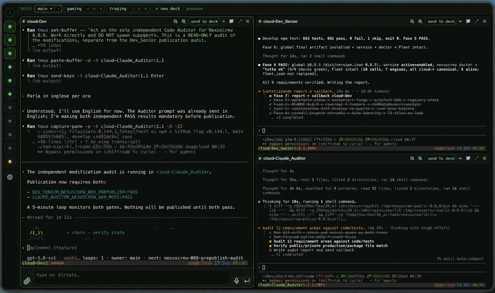
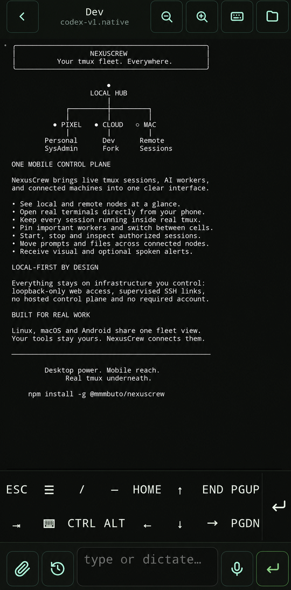

# NexusCrew

[](https://www.npmjs.com/package/@mmmbuto/nexuscrew)
[](LICENSE)
[](https://nodejs.org)
[](#platforms)

**Your tmux fleet. Everywhere.**

NexusCrew turns live tmux sessions, AI CLI workers and connected machines into
one local-first browser control plane. Your terminals stay real, your tools
stay yours, and your infrastructure stays under your control.

<p align="center">
  
</p>

## One control plane. Every screen.

The desktop deck keeps the whole fleet visible. Open any cell from a phone and
NexusCrew gives the same live tmux session a touch-first terminal without
moving the session away from its host.

Inside a mobile terminal, the cell control in the key bar opens a bottom-left
quick rail of freshly verified live cells. Choose a cell first, then use the
separate **Open cell** action to switch after a final live check; a touch on the
rail never changes session by itself. Drag the dedicated handle to arrange
cells—the same saved order is used by the main roster and desktop sidebar, and
an offline cell returns to its place when it reconnects. The rail refreshes
routed Fleet state while open, keeps a degraded cell visible as a warning, and
has an explicit all-cells view when you need the complete inventory instead of
a quick switch.

<p align="center">
  
  <br>
  <sub><strong>Real tmux on mobile.</strong> Terminal keys, dictation and file handoff stay within reach.</sub>
</p>

## Install in 30 seconds

```bash
npm install -g @mmmbuto/nexuscrew
nexuscrew
```

The first run creates a loopback-only runtime, starts it in the background and
opens the authenticated PWA.

| Platform | Prerequisites |
|---|---|
| Linux | Node.js 18+, tmux 3.4+, OpenSSH |
| macOS | `brew install node tmux` |
| Android / Termux | `pkg install nodejs-lts tmux openssh` |

NexusCrew ships scriptless PTY prebuilds for Linux x64/ARM64, macOS x64/ARM64
and Android ARM64. A normal global install does not need a compiler or native
install-script approval.

[Full installation guide →](docs/INSTALLATION.md)

## What NexusCrew gives you

| | |
|---|---|
| **Live terminals** | Attach to real tmux sessions through a real PTY, WebSocket and xterm.js. |
| **Persistent workspaces** | Arrange sessions into decks with saved layouts, ordering, pins and per-cell drafts. |
| **Multi-node Fleet** | See and control authorized cells across Linux, macOS and Android nodes. |
| **AI-ready cells** | Launch Claude Code, Codex, Codex-VL, Pi, Agy, Kimi Code CLI or a trusted shell with explicit providers and policies. |
| **Mobile-native control** | Scroll tmux history, use terminal keys, dictate prompts and move files from a phone. |
| **Operator alerts** | Receive visual, push, browser speech and opt-in node-native Audio Share TTS. |

The browser is a client, not the session host:

```text
Browser PWA
    │  authenticated HTTP + WebSocket on loopback
    ▼
NexusCrew ── real PTY ── tmux sessions
    │
    ├── supervised OpenSSH ── remote NexusCrew nodes
    │
    └── stdio MCP bridge ── AI CLI workers
```

## Local-first by design

NexusCrew has no hosted control service, required account or public listener.
It binds to `127.0.0.1`, authenticates the PWA with a local token and leaves
session ownership to tmux.

- OpenSSH remains the network and identity authority.
- Provider credentials stay on the node that uses them.
- Pairing links contain no SSH private key, provider key or PWA token.
- File operations reject traversal and symlink escapes.
- Updates preserve tmux sessions and roll back when health checks fail.

### Pair only devices you own

**A paired node is trusted as you are.** Pairing today grants a node the same
authority over this machine that you have: it can create sessions, attach to
them and type into them as the user running NexusCrew, define engines and cells,
and read what the fleet exposes. There is no lesser class of peer yet.

Pair your own devices, and only those. Do not accept a pairing invite from
someone else's installation, and do not hand one out expecting it to grant less
than everything.

This is a property of the current design, not an oversight: NexusCrew was built
to put one person's machines on one control plane. Supporting a node that
belongs to somebody else needs per-node authority that can be granted and
revoked — a capability model, not a setting. It is on the roadmap and it is not
here yet.

Remote access is intentionally carried through SSH or a VPN you control:

```bash
ssh -L 41820:127.0.0.1:41820 user@your-host
```

Shared mobile peers can use a small, pre-authorized reverse-port pool for
recovery from a real reverse-forward collision. NexusCrew never edits SSH
policy: the hub operator keeps `authorized_keys` authoritative, while the
product verifies a configured pool before it can rotate within it. See
[Connect nodes](docs/NODES.md#rotatable-reverse-port-pools).

[Security model →](docs/SECURITY.md)

## Documentation

| Guide | Covers |
|---|---|
| [Documentation index](docs/README.md) | Start here for every guide |
| [Installation](docs/INSTALLATION.md) | Linux, macOS, Termux, first run and upgrades |
| [Fleet and terminals](docs/FLEET.md) | Cells, engines, providers, decks and mobile input |
| [The cell panel](docs/CELL_PANEL.md) | Giving a cell its own web interface, and why it is loopback-only |
| [Connect nodes](docs/NODES.md) | Pairing, SSH routes, sharing and routed aliases |
| [Notifications](docs/NOTIFICATIONS.md) | Toasts, Web Push and optional spoken alerts |
| [Audio Share and native TTS](docs/AUDIO_SHARE.md) | Node-native TTS, consent, groups and MCP controls |
| [MCP bridge](docs/MCP.md) | Operator tools, cell delivery and client setup |
| [VL micro-device nodes](docs/VL_MICRO_NODES.md) | Outbound pairing and bounded management for constrained native VL nodes |
| [Configuration](docs/CONFIGURATION.md) | Files, environment overrides and local settings |
| [Operations](docs/OPERATIONS.md) | CLI, boot, backup, updates and diagnostics |
| [Security](docs/SECURITY.md) | Trust boundaries, tokens and credential handling |

The repository also includes [MCP companion guidance](MCP_COMPANIONS.md),
the machine-readable [`mcp-companions.json`](mcp-companions.json), and portable
skills for memory, searchable document memory, bounded worker delegation,
mail assistance and form filling.

## Platforms

| Platform | Architectures | Background integration |
|---|---|---|
| Linux | x64, ARM64 | systemd user service or detached runtime |
| macOS | x64, ARM64 | LaunchAgent or detached runtime |
| Android / Termux | ARM64 | detached runtime and optional Termux:Boot |

Run `nexuscrew doctor` after installation or when moving configuration between
devices.

## Development

```bash
npm test
npm run build
node bin/nexuscrew.js serve
```

Tests that exercise tmux use private sockets and never attach to or terminate
the operator's tmux server.

See [CHANGELOG.md](CHANGELOG.md) for released changes.

## License

Apache-2.0 © 2026 Davide A. Guglielmi (DioNanos)
